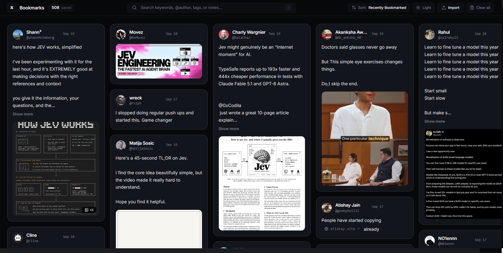
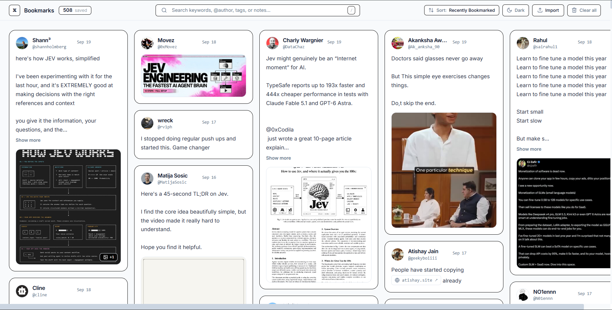
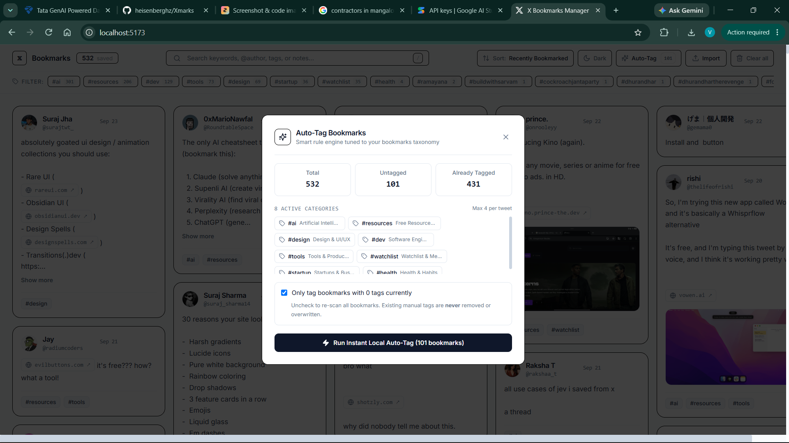

# 🔖 Xmarks — Your X (Twitter) Bookmarks, Finally Organized

> **A private, free, and local-first tool to export, organize, search, and browse your X (Twitter) bookmarks in a beautiful Pinterest-style masonry grid.**

[](./LICENSE)
[](https://react.dev/)
[](https://www.typescriptlang.org/)
[](https://tailwindcss.com/)
[](https://vitejs.dev/)
[](./extension)
[](./tests)
[](#-privacy-first--no-cloud-needed)

---

## 📸 See It in Action

| 🌙 Dark Mode (Elevated Slate & Silver Hairline) | ☀️ Light Mode (High-Contrast Crisp Borders) |
|:---:|:---:|
|  |  |

<p align="center">
  
  <br />
  <em>⚡ Instant 8-Category Auto-Tagging Dialog with category breakdown & <code>#untagged</code> queue</em>
</p>

---

## 😫 The Problem: Twitter Bookmarks Are a Black Hole

If you use X (Twitter), you probably bookmark amazing threads, tutorials, code snippets, design ideas, and industry news every day.

**Here's the frustrating reality:**
1. **You can never find anything again:** After saving a few hundred tweets, your bookmarks become an endless, single-column scroll where great content goes to die.
2. **Search is locked behind a paywall:** X charges a monthly Premium subscription just to search your own saved bookmarks.
3. **No way to organize:** You cannot add tags, categorize topics, or write notes explaining *why* you saved a tweet.
4. **Expensive developer API:** Building your own simple scraper through the official API costs $100+/month.
5. **No offline backup:** If an author deletes a tweet, or if your account is temporarily locked, your curated knowledge vanishes.

---

## 💡 What Xmarks Solves

**Xmarks** gives you full ownership of your bookmarked knowledge:

* 💸 **100% Free & Zero API Keys:** Export all your bookmarks directly from your authenticated browser session in seconds.
* 📌 **Pinterest-Style Visual Board:** View 20+ bookmarks at a glance with rich image galleries and video thumbnails instead of scrolling one tweet at a time.
* ⚡ **Instant Search (No Premium Required):** Find any bookmark in milliseconds. Search by keyword, author handle, author name, or even your own custom notes.
* 🏷️ **Smart 8-Category Auto-Tagging:** Automatically organizes your entire library into clean tags in under 0.2 seconds.
* 🎯 **Dedicated `#untagged` Queue:** Any bookmarks that don't match are labeled `#untagged` so you can review them with one click.
* 📝 **Personal Notes:** Add private notes to any tweet. Perfect for remembering key takeaways or action items (auto-saved to your browser).
* 🔒 **100% Private & Offline-First:** Everything runs locally on your machine using browser `IndexedDB`. Zero tracking, zero cloud databases, and zero analytics.

---

## 📊 Comparison: Default Twitter vs. Xmarks

| Feature | Default X (Twitter) | Official API Tier | 🔖 **Xmarks (This Project)** |
|:---|:---:|:---:|:---:|
| **Cost** | Free (view only) | $100+/month | **100% Free & Open Source** |
| **Bookmark Search** | 🔒 Paid (X Premium required) | Developer setup needed | **⚡ Instant & Offline (No Subscription)** |
| **Auto-Tagging Engine** | ❌ None | ❌ None | **⚡ Instant 8-category rule engine + `#untagged` queue** |
| **Interface Layout** | Single-column infinite scroll | Raw JSON data | **📌 Pinterest-style Multi-column Masonry** |
| **Custom Tags** | ❌ None | ❌ None | **✅ Unlimited custom tags (`#react`, `#ideas`)** |
| **Personal Notes** | ❌ None | ❌ None | **✅ Inline notes per tweet with auto-save** |
| **Media Preview** | Inline only | URLs only | **🖼️ Fullscreen lightbox & multi-image carousels** |
| **Data Ownership** | Stored on X servers | Stored on your server | **🔒 100% Local (Saved in browser IndexedDB)** |
| **Works Offline?** | ❌ No | ❌ No | **✅ Yes, completely offline** |

---

## ✨ Key Features in Detail

### 1. 🏷️ Smart Auto-Tagging & `#untagged` Review Queue
* **100% Offline & Instant:** Scans 500+ bookmarks in under 0.2 seconds without sending data anywhere.
* **8 Curated Categories:**
  * `#ai`: LLMs, agents, Claude, OpenAI, DeepSeek, prompts, fine-tuning.
  * `#resources`: Free books, courses, roadmaps, cheat sheets, guides.
  * `#design`: UI/UX, Figma, typography, typefaces, landing pages, animations.
  * `#dev`: Coding, GitHub repositories, systems, architecture, backend, frontend.
  * `#tools`: Cline, Cursor, browser extensions, productivity workflows.
  * `#watchlist`: Curated thriller series, movie threads, documentaries.
  * `#startup`: SaaS, monetization, building in public, marketing, founders.
  * `#health`: Workouts, posture, eye exercises, health habits.
* **Hashtags & Domain Recognition:** Pulls native `#hashtags` from tweets and maps domains (GitHub, Figma, Goalkicker, ArXiv).
* **Dedicated `#untagged` Queue:** Unmatched tweets get labeled `#untagged` so you can find them in your top filter bar with one click.
* **Safety First:** Your manual custom tags are **never** overwritten or deleted.

### 2. 📥 Two Simple Ways to Export Your Bookmarks
* **Option A — 10-Second Console Snippet (No install needed):** Open Chrome DevTools on your bookmarks page, paste the script from [`console-scraper.js`](./extension/standalone/console-scraper.js), and press Enter. It automatically scrolls humanly, harvests your bookmarks, deduplicates them, and downloads a clean JSON file.
* **Option B — Chrome Extension (MV3):** Load the lightweight unpacked extension into Chrome, click **Scrape Bookmarks**, watch the live progress counter, and export when done.

### 3. 📌 Pinterest-Style Responsive Grid
* Modern **16px rounded curves** (`rounded-2xl`) with matching **12px inner media corners**.
* **High-contrast styling:** Crisp 1px solid black borders in Light Mode, and elevated slate surfaces with subtle silver hairline borders in Dark Mode.
* Auto-detects and turns plain text links, `@mentions`, and `#hashtags` into clickable links.

### 4. 🔍 Blazing Fast Search & Tag Filters
* Sub-millisecond search across all tweet content, author names, handles, and personal annotations.
* Multi-select tag filters to narrow down your library in a click.
* Sort easily by **Recently Bookmarked**, **Newest First**, or **Oldest First**.

### 5. 📝 Personal Notes & Annotations
* Click **Add note** on any card to type your thoughts, summary, or reference links.
* Automatically debounces and saves to IndexedDB as you type.

### 6. ⌨️ Keyboard Shortcuts for Power Users
| Shortcut | Action |
|:---:|:---|
| <kbd>J</kbd> / <kbd>K</kbd> | Navigate to next / previous bookmark |
| <kbd>/</kbd> | Jump directly to search bar |
| <kbd>Esc</kbd> | Clear search input or close image lightbox / modal |
| <kbd>C</kbd> | Deselect currently active bookmark |

---

## 🚀 Getting Started

### Step 1: Export Your Bookmarks

#### Method A: Standalone DevTools Console (Fastest — zero installation)
1. In Google Chrome, navigate to [x.com/i/bookmarks](https://x.com/i/bookmarks) while logged in.
2. Open DevTools (<kbd>F12</kbd> or <kbd>Ctrl</kbd>+<kbd>Shift</kbd>+<kbd>I</kbd> / <kbd>Cmd</kbd>+<kbd>Option</kbd>+<kbd>I</kbd>).
3. Switch to the **Console** tab.
4. Copy the entire contents of [`extension/standalone/console-scraper.js`](./extension/standalone/console-scraper.js), paste it into the console, and hit <kbd>Enter</kbd>.
5. The script will scroll and gather your tweets, then download `bookmarks-export-<timestamp>.json`. (You can run `window.__X_SCRAPER__.stop()` anytime to stop early).

#### Method B: Unpacked Chrome Extension
1. Open Chrome and navigate to `chrome://extensions/`.
2. Toggle on **Developer mode** in the top-right corner.
3. Click **Load unpacked** (top-left) and select the `extension` folder from this repository.
4. Go to [x.com/i/bookmarks](https://x.com/i/bookmarks) and click the extension icon in your Chrome toolbar.
5. Click **Scrape Bookmarks**, then click **Stop & Export** when done.

---

### Step 2: Run the Web App Locally

Make sure you have [Node.js](https://nodejs.org/) (v18 or higher) installed.

```bash
# 1. Clone this repository
git clone https://github.com/heisenberghz/Xmarks.git
cd Xmarks

# 2. Install dependencies
npm install
cd app && npm install && cd ..

# 3. Start the local server
npm run dev
```

Open [http://localhost:5173](http://localhost:5173) in your browser.

---

### Step 3: Import & Enjoy!

1. Click **Import** on the top navigation bar or drag-and-drop your exported `.json` file.
2. Click **Auto-Tag** in the navigation bar to automatically categorize your library in seconds.
3. *Want to test right away without exporting?* A mock dataset is included at [`sample-data/bookmarks-export-sample.json`](./sample-data/bookmarks-export-sample.json).
4. All bookmarks are saved to your browser's local **IndexedDB** and will stay there even if you refresh or close the tab.

---

## 🏗️ Project Architecture

```text
Xmarks/
├── app/                              # Offline React + Vite + Tailwind web app
│   ├── src/
│   │   ├── components/               # TopNav, BookmarkCard, MasonryGrid, Lightbox, AutoTagModal
│   │   ├── lib/                      # db.ts, search.ts, tagRules.ts, tagTaxonomy.ts, useTheme.ts
│   │   ├── types/                    # Data models for tweets, media, notes, and tags
│   │   └── index.css                 # Custom design tokens, high-contrast borders & surfaces
│   └── package.json                  # Web app dependencies & Vite config
│
├── extension/                        # Manifest V3 Chrome Extension
│   ├── manifest.json                 # Extension configuration
│   ├── popup.html & popup.js         # Extension UI with live scraping counter
│   ├── background.js                 # Service worker message handler
│   ├── content.js                    # In-page DOM harvester & virtual-scroll handler
│   └── standalone/
│       └── console-scraper.js        # Zero-install standalone DevTools scraper
│
├── sample-data/
│   └── bookmarks-export-sample.json  # Sanitized sample dataset for instant testing
│
├── screenshots/                      # UI previews and showcase screenshots
├── tests/                            # Vitest unit test suite (DOM parsing, scroller, tag engine)
├── .gitignore                        # Strict rules to keep personal bookmark dumps private
├── LICENSE                           # Open source MIT license
└── package.json                      # Root workspace scripts (dev, build, test)
```

---

## 🧪 Testing & Verification

The automated test suite verifies DOM tweet extraction, multi-image and video poster parsing, virtual scroll unmounting, deduplication, search ranking, theme logic, and the 8-category rule engine:

```bash
# Run Vitest across all 17 test suites (97 tests)
npm test

# Run production build check
npm run build
```

---

## 🔒 Privacy First — No Cloud Needed

* **Zero Cloud Storage:** Your bookmarks and notes are stored strictly inside your browser's local IndexedDB.
* **Zero Telemetry:** No tracking, no cookies, no third-party analytics scripts.
* **Safe Git Defaults:** [`.gitignore`](./.gitignore) is pre-configured to ignore all personal `bookmarks-export*.json` files so you never accidentally push personal bookmarks to GitHub.

---

## ❓ Frequently Asked Questions

<details>
<summary><b>Will my X (Twitter) account get banned or flagged?</b></summary>
<p>No. Both the extension and console script simply scroll down the page and read the tweets that are already rendered in your browser, exactly as if you were scrolling by hand. They do not send automated API requests or bypass any security checks.</p>
</details>

<details>
<summary><b>Do I need to pay for Twitter / X Premium?</b></summary>
<p>No! That is the whole point of Xmarks. You can scrape, search, and auto-tag all your bookmarks without paying for any subscription.</p>
</details>

<details>
<summary><b>How does the Auto-Tagging work?</b></summary>
<p>It runs 100% locally in your browser. It analyzes tweet text against curated keyword dictionaries, extracts in-tweet hashtags, checks author handles, and matches external links. Any bookmarks that do not match are labeled <code>#untagged</code> so you can review them easily.</p>
</details>

<details>
<summary><b>Can I backup or export my data again?</b></summary>
<p>Yes. The web app includes an <b>Export</b> button that lets you download your entire enriched library (including your custom tags and notes) into a JSON backup file at any time.</p>
</details>

---

## ⚖️ License

Distributed under the [MIT License](./LICENSE).

---

*Disclaimer: This project is an independent open-source tool and is not affiliated with, endorsed by, or associated with X Corp.*
